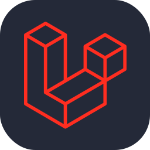

<h1 align="center">Welcome to Lucas Kim's GitHub Profile</h1>

🌟 <a href="https://www.linkedin.com/in/lkm227" target="_blank">LinkedIn</a> | 🌟 <a href="https://github.com/lkim227" target="_blank">GitHub</a>

 
<h3 align="center">Languages and Tools</h3>

    <!-- Programming Languages -->
    
    
    
    
    
    
    
    
    
    
    
    
    
    
    <!-- Frameworks/Libraries -->
    
    
    
    
    
    
    
    
    
    
    
    
    
    
    
    
    
    
    
    
    <!-- Databases -->
    
    
    
    
    <!-- Tools/Platforms -->
    
    
    
    
    
    
    
    
    
    
    
    
    
    
    
    
    
    
    
    
    
    
    
    

### 👨‍💻 About Me

I am a **Senior Full Stack Developer** with over six years of experience in designing and implementing advanced software solutions. I specialize in both frontend and backend development, with a strong foundation in Python, Django, Next.js, and NestJS. My expertise extends to optimizing PostgreSQL schemas, integrating RESTful APIs, and leveraging Docker and CI/CD pipelines to streamline development and deployment processes. I'm passionate about Web3 and blockchain technologies, focusing on Rust and smart contracts.

---

### 🎓 Education

- **Master's Degree in Computer Science**  
  Arden University, Berlin  
  Oct 2018 – Sept 2019

- **Bachelor's Degree in Computer Science**  
  Jilin International Studies University, China  
  Sept 2014 – Sept 2018

---

### 🛠️ Technical Skills

**Languages:**  
SQL (PostgreSQL, MySQL), JavaScript (ES6, Node.js), HTML/CSS, PHP, UML, React, Django, Liquid, C, C++, Java, TypeScript

**Frameworks/Libraries:**  
NestJS, Vue, Angular, Redux, Next.js, Docker, Jest (unit & e2e tests), Svelte, React, Django, Laravel, Chrome Extension, AI (IPython, YOLO)

**Databases:**  
PostgreSQL, MongoDB

**Tools/Platforms:**  
Microservices (Kafka, RabbitMQ, MQTT), SEO, Git, CI/CD (GitHub Actions), Docker, Kubernetes, Cloud Servers (AWS, Azure, ThingsBoard)

**Project Management:**  
Nifty, Agile methodologies

**Design/Prototyping:**  
Figma, UI/UX Design

**Languages Spoken:**  
English, Chinese, Korean

---

### 🏆 Experience

**Full Stack Developer | Confidential Retail Technology Company**  
*Aug 2024 – Present*  
- Led the integration of a Python Django project with Shopify to enhance the retail technology platform.
- Developed a centralized system for managing unsold inventory across retail channels.
- Enhanced user experience by facilitating the purchase of discounted items from nearby stores.

**Full Stack Team Lead & Project Manager | Confidential**  
*Sept 2023 – Aug 2024*  
- Led the development of a Hotel Reservation System, optimizing guest booking experiences.
- Managed project planning and coordination among cross-functional teams using Nifty.
- Implemented scalable backend solutions with NestJS and Kafka microservices.

**Shopify Developer | WIGME.COM**  
*Sept 2021 - Dec 2022*  
- Enhanced e-commerce platform usability through Shopify theme development and React integration.
- Redesigned and optimized design editor, reducing bounce rates by 40%.

**Full-Stack Developer (Remote) | STORE.MOMOFUKU.COM**  
*May 2020 - Sept 2021*  
- Optimized MOMOFUKU's online store platform and led AWS infrastructure optimization, increasing revenue by 20%.

**IoT Engineer & Software Developer | NEWYORKFASHIONHOUSENY.COM**  
*Sept 2019 – Jun 2020*  
- Developed "Make Your Home Smart," an IoT solution for residential automation.

---

### 🌐 GitHub Projects

**Highlighted Repositories:**

- [**Next.js Hotel Reservation System**](https://github.com/lkim227/hotel-reservation-system): A hotel booking platform with intuitive UI/UX designed using Figma.
- [**Shopify and React Integration**](https://github.com/lkim227/shopify-react-integration): Enhancements and customizations to Shopify themes using React and Redux.
- [**IoT Home Automation Project**](https://github.com/lkim227/iot-home-automation): An IoT-based project for residential automation integrated with ThingsBoard.
- [**Web3 and Blockchain Development**](https://github.com/lkim227/blockchain-dev): A collection of smart contracts and Web3 tools developed using Rust.

Explore more of my projects on my [GitHub profile](https://github.com/lkim227).

---

### 📊 GitHub Stats

---

### 🏆 Trophies

---

### 📫 Contact

- **Email:** [lucas98kim227@gmail.com](mailto:lucas98kim227@gmail.com)
- **WhatsApp:** [+65 9240 7360](https://wa.me/6592407360)
- **Skype:** [live:.cid.9f6b5ffee2f05b0c](skype:live:.cid.9f6b5ffee2f05b0c)
